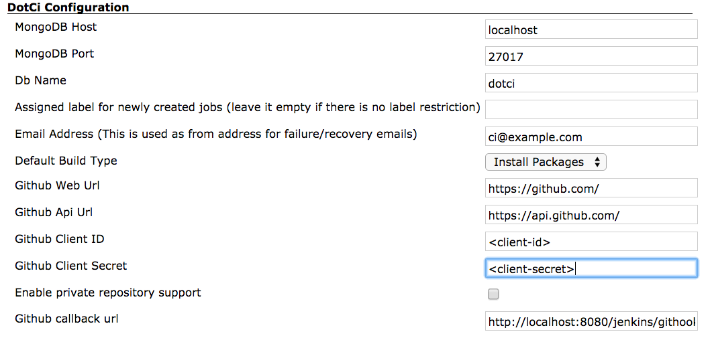

# Pre-Requisites

### Mongo DB

Install [mongodb](https://www.mongodb.org/) in a location accessible to your Jenkins instance.


### Github Application

Register an [OAuth Application](https://github.com/settings/applications/new) with GitHub
to generate __Client ID__ and __Client Secret__. 
The __Authorization callback URL__ needs to be `http://<YOUR-JENKINS-URL>/dotci/finishLogin`

# Configure Master

1. Go to `Manage Jenkins` > `Configure Plugins` and install `DotCi`
   plugin.
2. Go to `Manage Jenkins` > `Configure System` and fill out required information under DotCi Configuration:

   

# Docker Slave

A slave that can build for docker build types, i.e.  [Docker Compose](../usage/ci_yml/build_types/DockerCompose.md), must have the
following installed in addition to required Jenkins software:

* [docker](https://www.docker.com)
* [docker-compose](https://docs.docker.com/compose/install/)

#MongoDB indexes

* Builds for project
```
db.run.ensureIndex( {projectId: 1 } )
```

* Builds by number
``` 
db.run.ensureIndex( {number: 1 } )
```
* Builds by Result and Project
```
db.run.ensureIndex( {projectId: 1, result: 1 } )
```
* Builds for user
```
db.run.ensureIndex( {className: 1, 'actions.causes.user': 1, 'actions.causes.pusher': 1 } )
```

* Builds capped for 30 days
```
db.run.ensureIndex( { "timestamp": 1 }, { expireAfterSeconds: 2592000 } )
```

